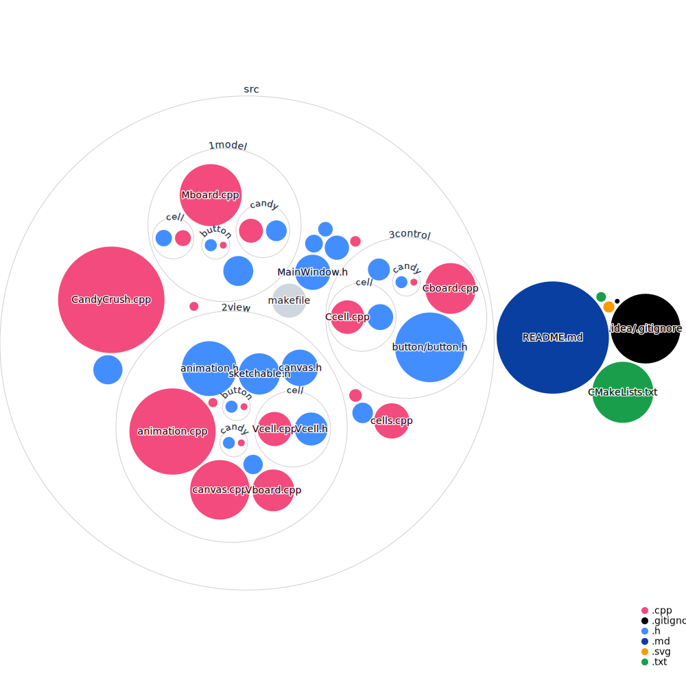

# KanaCrush

INFO-F-202
Langages de programmation 2
Université libre de Bruxelles
Projet
Justin Dallant John Iacono
Yannick Molinghen Alexis Reynouard
1 Sommaire
Le but de votre projet est de coder un jeu inspiré de Candy Crush Saga, un jeu créé par King.
Les bases du jeu ne sont pas expliquées ici, si vous ne le connaissez pas, veuillez l’installer et
jouer jusqu’à ce que vous le connaissiez. Ensuite, arrêtez de jouer. Ce site web de fans peut
également être utile car il explique les différents éléments et la terminologie du jeu.
Vous pouvez réaliser le projet individuellement ou en groupe de deux. Si vous le complétez en
groupe, les deux étudiants recevront des notes identiques (sauf si un étudiant ne se présente
pas à la présentation orale).
Vous devez remettre :
— Un zip avec votre code, d’autres fichiers nécessaires (vous pouvez utiliser des images ou
des fichiers texte) et un Makefile.
— Un document au format pdf expliquant votre démarche (voir ci-dessous)
Ces documents sont dûs le 13 janvier à 23h59 pour la première session. Les dates de la session
d’été seront annoncées ultérieurement.
La semaine du 17 janvier, un entretien oral sera programmé au cours duquel vous ferez une
démonstration de votre programme et répondrez aux questions.
2 Notation
La notation comprendra plusieurs éléments :
— Tâches terminées.
— Rapport écrit.
— Style de code.
— Présentation orale et questions.
— Retard.
Votre note maximale sera de 10 si vous ne terminez que la première tâche et passera à 20 si
vous terminez toutes les tâches. Le style de votre code, votre rapport écrit, votre présentation
orale et vos questions détermineront votre note par rapport au maximum déterminé par le
nombre de tâches que vous effectuez.
1
3 Tâches
1. Fonctionnalité de base. Cela implique d’avoir un plateau de 9 × 9, chaque carré a
un bonbon (candy) normal (Rouge/Orange/Jaune/Vert/Bleu/Violet), bien que vous ne
souhaitiez peut-être pas utiliser toutes les six couleurs. La fonctionnalité de base est
de permettre de choisir un carré et de l’échanger avec un carré adjacent si cela crée un
alignement de trois bonbons de la même couleur (horizontalement ou verticalement).
Chaque fois que trois bonbons d’affilée ont la même couleur, ils sont supprimés et les
bonbons d’en haut tombent. Les espaces vides en haut sont peuplés de nouveaux bonbons aléatoires. Aucune animation n’est requise pour cette tâche, et vous pouvez utiliser
n’importe quelle méthode pour choisir et déplacer un carré, que ce soit à la souris ou
au clavier.
2. Animation des objets en cours de suppression. Lorsque les bonbons correspondent,
animez leur suppression, et la chute de nouveaux bonbons.
3. Murs. Plutôt que d’avoir une grille de 9x9 pleine de bonbons, permettez à certains des
carrés d’être des murs qui ne bougent jamais. Les carrés du haut qui ne sont pas
des murs sont là où tombent les nouveaux bonbons. Quand les bonbons tombent, ils
peuvent descendre en diagonale vers le bas pour remplir les trous vides causés par les
murs. Vous devriez avoir un bon moyen d’encoder où se trouvent les murs ; il est probablement préférable de lire un fichier contenant une représentation ASCII 9x9 de la
carte.
4. Faire glisser le carré. Pour cette tâche, pour sélectionnez un mouvement dans le jeu,
vous cliquez sur un carré et le faites glisser vers un carré adjacent. Ce clic et ce glissement doivent être animés comme dans le jeu original.
5. Impossible. S’il n’y a pas de mouvement possible, remplacez au hasard tous les carrés
de bonbons normaux, après avoir affiché un message et attendu une courte période de
temps.
6. Glaçage. C’est un terme générique pour les cases qui sont occupées mais deviennent
libres lorsqu’une explosion se produit sur elles ou sur une case adjacente. Vous devez
créer deux types de glaçage : simple et double. Le glaçage simple devient vide, tandis que
le glaçage double devient un glaçage simple. L’indication des carrés ayant un glaçage
doit être effectuée dans le cadre du fichier contenant la conception du tableau de la
tâche 3.
7. Bonbons spéciaux. Ajoutez des bonbons rayés, des bonbons emballés et une bombe de
couleur. Ils devraient fonctionner comme dans le jeu.
8. Score. Ajoutez une fenêtre avec le score_. Le score_ doit être incrémenté pour divers événements, comme chaque fois qu’un bonbon a été effacé. Dans le jeu original, le calcul
du score_ est complexe. Vous pouvez faire quelque chose de simple, mais expliquez dans
votre rapport comment vous procédez.
9. Meilleur score_. Affichez-le toujours quelque part sur l’écran principal du jeu. Cela devrait être enregistré et durer d’une session à l’autre dans un fichier (mais vous devriez
avoir un moyen de le réinitialiser !)
10. Écran d’accueil. Lorsque vous démarrez le jeu, un écran d’accueil devrait apparaître
pendant une seconde avant que l’écran principal du jeu ne soit chargé. L’écran d’accueil
doit inclure votre nom.
11. Suggestions. Dans le jeu original, si vous ne faites pas de mouvement pendant quelques
secondes, un mouvement est suggéré via une animation pulsée.
12. Niveaux et sélection de niveau. Implémentez différents niveaux que vous enregistrez
dans un ou plusieurs fichiers. Vous devez y retenir l’emplacement des murs, le glaçage et
le nombre de couleurs différentes de bonbons. Il vous faut ensuite un écran de sélection
de niveau et un moyen d’y accéder depuis le menu principal. L’écran de sélection de
niveau peut être simple, contrairement à celui du jeu original. Dans le jeu original, les
niveaux peuvent être verrouillés ; ici, vous pouvez accéder librement à tous les niveaux.
2
13. Objectifs. Dans le jeu original, chaque niveau a un objectif. Vous devriez commencer
par supposer que le but est d’enlever tout le glaçage en un certain nombre de coups. Si
un but est atteint, le joueur doit être félicité puis déplacé au niveau suivant, sinon si
le nombre de coups est épuisé, le niveau recommence après un message de défaite. Le
nombre de coups restants doit être affiché.
14. Éditeur de tableau. Ajoutez la possibilité de pouvoir modifier un niveau de manière
interactive au lieu d’y jouer. Ce n’est évidemment pas dans le jeu original ! Vous devriez
pouvoir enregistrer les modifications et ajouter de nouveaux niveaux.
15. Niveaux à ingrédients. Ajoutez la possibilité de créer des niveaux avec des ingrédients
qu’il faut faire tomber (comme les cerises et les noisettes dans le jeu original).
4 Style de codage
Votre score_ de style de codage sera basé sur la façon dont vous codez en utilisant les principes
de la programmation orientée objet.
— Tout doit être décomposé en classes et en fichiers.
— Aucune variable globale.
— Pas de logique répétée.
— Commentaires et documentation du code.
— Le code des méthodes individuelles doit en général être assez court.
— Utilisation correcte des constructeurs et des destructeurs.
— N’utilisez aucune des classes compliquées de fltk. Utilisez simplement les fonctions de
dessin, placées dans des classes comme nous l’avons fait dans les laboratoires.
— Si vous utilisez le modèle de conception MVC (Cela sera couvert dans l’avant-dernière
leçon.)
Je vous encourage vivement à placer le code dans plusieurs fichiers. En particulier, les classes
de dessin de base qui appellent les fonctions fltk doivent être séparées de votre code spécifique
à Candy Crush.
5 Questions orales
Vous aurez une présentation orale pendant laquelle il vous sera demandé de faire une démonstration de votre programme et de votre code. Durant cette présentation nous vous poserons
quelques questions à ce sujet. Nous vous demanderons peut-être d’apporter une modification
mineure au code pour voir si vous comprenez votre propre code. Si vous avez réalisé le projet
en équipe de deux, les deux membres de l’équipe doivent se présenter ensemble.
6 Rapport écrit
Vous devez inclure un court rapport écrit au format PDF. Celui-ci doit au minimum comprendre les points suivants
— Tâches. Indiquez les tâches que vous avez accomplies.
— Classes. Pour chaque classe, fournissez l’interface (pas le corps des méthodes) et décrivez brièvement le rôle de chaque classe et comment elle se rapporte aux autres classes.
3
— Logique du jeu. Supposons que je démarre le jeu, sélectionne le premier niveau (si la
tâche 11 est terminée), attend 10 secondes, puis fais un coup. Décrivez en détail ce qui
se passe dans votre code.
— Modèle-Vue-Contrôleur. Avez-vous utilisé ce modèle de conception ? Si c’est le cas, expliquez comment vos classes correspondent à ce modèle de conception.
— Score. Si vous avez terminé la tâche 8, expliquez comment vous calculez le score_.
7 Retard
Vos points seront réduit de 1% pour chaque heure de retard.
8 Ce sur quoi vous n’êtes PAS noté
Vous êtes noté sur votre capacité à créer un programme volumineux, complexe et orienté objet.
Vous n’êtes pas noté sur votre capacité à avoir un beau jeu. Normalement, un graphiste créerait
de jolis éléments visuels, et vous êtes des informaticiens, pas des graphistes. Cela devrait être
assez bon pour que les différents éléments soient reconnaissables et que les animations soient
raisonnables, mais aller au-delà n’aidera pas votre note.
9 Plagiat
Je dois aborder le problème du plagiat dans le code. Ce n’est pas facile, car il est tout à fait
normal de couper et coller de petits morceaux de code. Cependant, il n’est pas acceptable que
vous copiez toute la logique liée à l’écrasement des bonbons d’autres étudiants ou du Web.
La règle suivante s’applique : si vous avez plus d’une seule ligne de code que vous avez obtenue
ailleurs, vous devez inclure un commentaire avec l’endroit où vous l’avez obtenue (comme
l’URL). Je note que vous êtes libre de partager toutes les classes que vous créez qui encapsulent
un simple dessin fltk avec d’autres étudiants, tant que vous les publiez publiquement sur le
canal de projet des équipes.
Toute violation de cette politique, même minime, peut entraîner un 0 sur le projet.
Nous ne ferons pas de distinction entre ceux qui ont fourni du code et ceux qui ont copié du
code ; si deux groupes partagent le code sans attribution, les deux obtiendront un 0. Vous
pouvez éviter cela en insérant simplement un commentaire !
4
